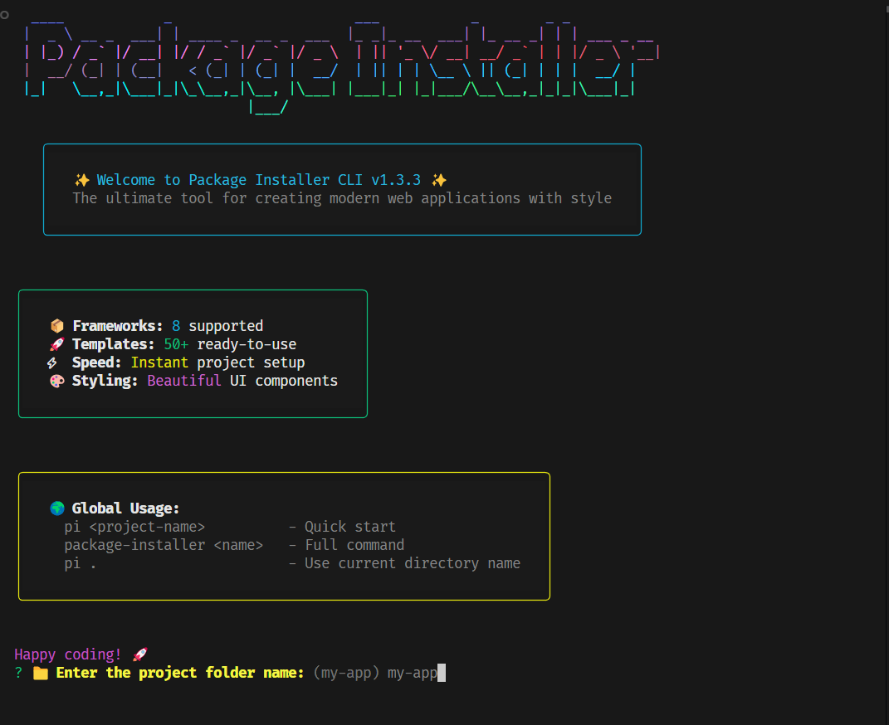

# Package Installer CLI (pi)

[](https://www.npmjs.com/package/package-installer-cli)
[](https://opensource.org/licenses/MIT)
[](https://nodejs.org/)

**NPM Package:** [https://www.npmjs.com/package/package-installer-cli](https://www.npmjs.com/package/package-installer-cli)

A modern, cross-platform CLI tool to scaffold web applications with beautiful styling, interactive prompts, and comprehensive framework support. Create production-ready projects in seconds with the ultimate developer experience.

## ✨ Features

- 🚀 **8+ Frameworks** - Next.js, React, Vue, Angular, Express, Rust, **Remix**, **NestJS**
- 💻 **Language Support** - JavaScript & TypeScript
- 🧩 **UI Libraries** - Shadcn/ui, Material-UI, Headless UI
- 📦 **Bundler Options** - Vite and more
- 🎨 **Beautiful Styling** - Gradient colors, styled boxes, enhanced UX
- 🌍 **Cross-platform** - Works on Windows, macOS, Linux, WSL
- ⚡ **Fast Scaffolding** - Get started in seconds
- 🔧 **Dual Commands** - Use `pi` or `package-installer`
- 📁 **Smart Project Names** - Use "." for current directory name
- 👋 **Graceful Exits** - Proper error handling and goodbye messages

## 🚀 Quick Start

### Global Installation

```bash
# Using npm
npm i -g pi

# Using pnpm
pnpm i -g pi

# Using yarn
yarn global add pi
```

### Usage

```bash
# Quick command
pi

# Full command name
package-installer

# With project name
pi my-awesome-app

# Use current directory name
pi .
```

## 📋 Available Frameworks & Templates

### Frontend Frameworks
- **Next.js** (JavaScript/TypeScript)
  - With/without src directory
  - With/without Tailwind CSS
  - With/without Shadcn/ui
  
- **React.js** with Vite (JavaScript/TypeScript)
  - With/without Shadcn/ui
  - With/without Tailwind CSS
  
- **Vue.js** (JavaScript/TypeScript)
  - With/without Tailwind CSS
  - With/without Headless UI
  
- **Angular** (TypeScript)
  - With/without Tailwind CSS
  - With/without Material-UI

### Modern Full-Stack Frameworks
- **Remix** (TypeScript) 🆕
  - With/without Shadcn/ui
  - With/without Tailwind CSS
  - Full-stack React framework

- **NestJS** (TypeScript) 🆕
  - Enterprise-ready backend framework
  - Simplified setup with single template
  - Built-in TypeScript support

### Backend Frameworks
- **Express.js** (JavaScript/TypeScript)
  - Basic template
  - Advanced template (with MongoDB, JWT, testing)

### Systems Programming
- **Rust**
  - Basic template
  - Advanced template

## 🎯 Enhanced Workflow

1. **Run command** - `pi` or `package-installer`
2. **Project name** - Enter name or use "." for current directory
3. **Choose framework** - Select from 8+ modern frameworks
4. **Select language** - JavaScript or TypeScript
5. **Configure options** - UI library, bundler, styling
6. **Review summary** - Beautiful configuration overview
7. **Project created!** 🎉 - Auto-install dependencies

## 🎨 Enhanced Styling

The CLI features a modern, beautiful interface with:

- **Gradient ASCII Art** - Vibrant multi-color banner
- **Styled Information Boxes** - Color-coded sections
- **Interactive Prompts** - Emoji-enhanced questions
- **Progress Indicators** - Animated spinners
- **Success Messages** - Detailed next steps
- **Error Handling** - Graceful error messages

## 📸 Screenshots

### Main Interface


### Framework Selection
- Interactive list with 8+ frameworks
- Color-coded framework themes
- Detailed descriptions

### Project Summary
- Beautiful configuration overview
- Color-coded options
- Clear next steps

## 🛠️ Development

### Local Development

```bash
# Clone the repository
git clone https://github.com/0xshariq/package-installer-cli.git
cd package-installer-cli

# Install dependencies
npm install

# Build the project
npm run build

# Run locally
node dist/index.js

# Or use the pi command
./dist/index.js
```

### Project Structure

```
package-installer-cli/
├── src/
│   └── index.ts          # Main CLI logic with enhanced styling
├── templates/            # Template directories
│   ├── nextjs/
│   ├── reactjs/
│   ├── vuejs/
│   ├── angularjs/
│   ├── expressjs/
│   ├── remixjs/          # 🆕 Remix templates
│   ├── nestjs/           # 🆕 NestJS templates
│   └── rust/
├── template.json         # Framework configurations
├── dist/                 # Compiled JavaScript
└── package.json
```

### Key Features Implementation

- **Dual Command Support**: Both `pi` and `package-installer` commands
- **Smart Project Names**: Handles "." for current directory
- **Enhanced Error Handling**: Graceful exits and proper error messages
- **Framework Validation**: Ensures compatible options
- **Auto Dependency Installation**: Tries pnpm first, then npm

## 🎯 Command Examples

```bash
# Basic usage
pi

# Create project with name
pi my-next-app

# Use current directory name
pi .

# Full command name
package-installer my-react-app

# Help and version
pi --help
pi --version
package-installer --help
```

## 🔧 Framework-Specific Features

### Remix
- **Blue theme** with modern styling
- **Shadcn/ui integration** with Tailwind CSS
- **Template validation** for UI library requirements
- **3 template variants** for different setups

### NestJS
- **Magenta theme** for enterprise feel
- **Simplified setup** - no extra questions
- **Single template** for consistency
- **TypeScript-only** for type safety

### Express.js
- **Green theme** for backend development
- **Basic and Advanced** templates
- **MongoDB integration** in advanced template
- **Testing setup** with Jest

## 🤝 Contributing

We welcome contributions! Here's how to get started:

1. **Fork** the repository
2. **Create** your feature branch (`git checkout -b feature/amazing-feature`)
3. **Commit** your changes (`git commit -m 'Add amazing feature'`)
4. **Push** to the branch (`git push origin feature/amazing-feature`)
5. **Open** a Pull Request

### Development Guidelines

- Follow TypeScript best practices
- Add proper error handling
- Include emoji and styling for new features
- Update documentation for new frameworks
- Test on multiple platforms

## 📝 License

MIT License - see [LICENSE](LICENSE) file for details.

## 🙏 Acknowledgments

- Built with ❤️ for the developer community
- Inspired by modern CLI tools like `create-next-app`, `create-react-app`
- Enhanced with beautiful styling and developer experience

---

**Made with ❤️ by [Sharique Chaudhary](https://github.com/0xshariq)**

*Star this repository if you find it helpful! ⭐*
